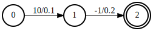
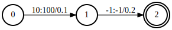
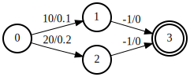
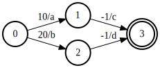
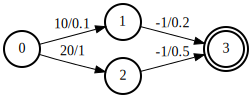
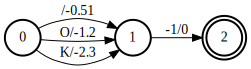
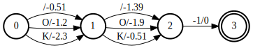
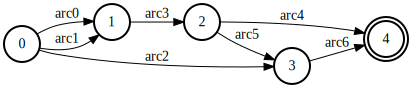
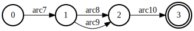

Core concepts in k2
===================

Please refer to :cite:`mohri1997finite`, :cite:`mohri2002weighted`, and
:cite:`mohri2008speech` for an introduction about weighted finite state
acceptor (WFSA) and weighted finite state transducer (WFST).

We use FSA to indicate either WFSA or WFST in k2.

A simple FSA example
---------------------

A simple FSA is shown in :numref:`a simple fsa`.

.. _a simple fsa:

    A simple FSA in k2.

- It has three states: 0, 1, and 2. State 0 is the start state
  and state 2 is the final state.
- There are 2 arcs. The first arc is from state 0 to state 1
  with label 10 and score 0.1. The second arc is from state 1 to
  the final state 2 with label -1 and score 0.2.

.. HINT::

  We use arc weight and arc score interchangeably in k2.

The above FSA is created with the following code:

.. code-block:: python

    import k2
    s = '''
    0 1 10 0.1
    1 2 -1 0.2
    2
    '''
    fsa = k2.Fsa.from_str(s)
    fsa.draw('simple_fsa.svg')

We summarize the **unique** features of FSA in k2 in below:

  - There is only one start state
  - The start state is **always** 0
  - All other states have a state number greater than 0
  - There is only one final state
  - The final state **always** has the **largest** state number
  - Arcs entering the final state **always** have -1 as the label
  - Arcs that do not enter the final state cannot have -1 as the label
  - States have no scores
  - All scores are on the arcs
  - We store weights in the **positive** ``sense`` rather than as costs

    .. CAUTION::

        We store them as log-probs rather than negative log-probs,
        and call them ``"scores"`` to indicate this.

        They can come directly from the output of a log-softmax layer.

.. HINT::

  Different from other frameworks, FSAs in k2 have only a single final state.

  If you want to convert an FSA from another framework to k2 that contains
  multiple final states, you can create an extra state and consider it as
  the super final state. For each final state in the FSA, add an arc to this
  super final state with label -1 and score equal to the final-weight of that
  final state. The resulting FSA will contain only a single final state.

  Similarly, if it contains multiple start states, you can add a super start
  state and set both the label and score of the arcs added from the super start
  state to the start state to 0.

.. NOTE::

  k2 supports conversion of FSAs from OpenFST. See :func:`k2.Fsa.from_openfst`.

Attributes
----------

Arbitrary attributes can be attached to the arcs of an FSA.
For example, we can attach a tensor attribute to an FSA indicating
the output label of arcs so that the FSA is converted to an FST.

The attached attributes are **automaticaly propagated** through operations,
with ``autograd`` if they are real-valued tensors.

The following code converts the above simple acceptor to a transducer:

.. code-block:: python

    import k2
    import torch
    s = '''
    0 1 10 0.1
    1 2 -1 0.2
    2
    '''
    fsa = k2.Fsa.from_str(s)
    fsa.aux_labels = torch.tensor([100, -1], dtype=torch.int32)
    fsa.draw('simple_fst.svg')

The resulting FST is visualized in :numref:`a simple fst`.

.. _a simple fst:

    A simple FST in k2.

.. CAUTION::

  There are NO **output labels** in k2. Every arc has a label and you
  can attach arbitrary attributes with arbitrary name to it.

  If the attached attribute is an N-D tensor, its ``shape[0]`` has to
  equal the number of arcs in the FSA.

.. NOTE::

  The visualization code handles the attributes ``aux_labels`` specially.
  Other than this, ``aux_labels`` is like any other attributes attached
  to the FSA.

Semirings
---------

In the FSA literature, generality is achieved through the concept
of "semirings". The two most common are the "tropical semiring"
and "log semiring". The way we will explain these is a little
different from the literature because we are using the **opposite** sign.

We won't get into the formalism here, but it relates to what happens
when you combine scores from multiple alternative paths.

The two common semirings supported by k2 are:

  - **tropical semiring**: take the maximum score (or minimum cost)
  - **log semiring**: log-add the scores (or the negatives of the costs).

While k2 only supports these two operations for the core operations,
the framework is designed to be flexible through the concept of
"attributes" which make it possible to implement the kinds of
things that are normally accomplished through exotic semirings
such as the Gallic semiring.

Tropical semiring
~~~~~~~~~~~~~~~~~

In tropical semirings, it takes the **max** score of alternative paths.

For example, for the FSA in :numref:`tropical`:

.. _tropical:

    An FSA with two alternative paths to the final states.

There are two paths from the start state to the final state:

  - Path 0: state 0 -> state 1 -> state 3, with score: 0.1 + 0 = 0.1
  - Path 1: state 0 -> state 2 -> state 3, with score: 0.2 + 0 = 0.2

So in the tropical semiring, we would consider that "total score" of
this FSA is ``max(0.1, 0.2) == 0.2``.

In k2, you would use the following code to compute it:

.. code-block:: python

    import k2
    s = '''
    0 1 10 0.1
    0 2 20 0.2
    1 3 -1 0
    2 3 -1 0
    3
    '''
    fsa = k2.Fsa.from_str(s)
    fsa.draw('fsa2.svg')
    fsa = k2.create_fsa_vec([fsa])
    total_scores = fsa.get_tot_scores(log_semiring=False, use_double_scores=False)
    print(total_scores)
    # It prints: tensor([0.2000])

.. HINT::

    :func:`k2.Fsa.get_tot_scores` takes a vector of FSAs as input,
    so we use :func:`k2.create_fsa_vec` to turn an FSA into a vector of FSAs.

    Most operations in k2 take a vector of FSAs as input and process them
    in parallel.

Log semiring
~~~~~~~~~~~~

In log semirings, it takes the **log_add** score of alternative paths.

For example, if there are two paths with score ``a`` and ``b``, then the
total score is ``log(exp(a) + exp(b))``.

Take the FSA in :numref:`tropical` as an example, the total score is
``log(exp(0.1) + exp(0.2)) = 0.8444``.

The code in k2 looks like:

.. code-block:: python

    import k2
    s = '''
    0 1 10 0.1
    0 2 20 0.2
    1 3 -1 0
    2 3 -1 0
    3
    '''
    fsa = k2.Fsa.from_str(s)
    fsa = k2.create_fsa_vec([fsa])
    total_scores = fsa.get_tot_scores(log_semiring=True, use_double_scores=False)
    print(total_scores)
    # It prints: tensor([0.8444])

Vectors of FSAs
---------------

The Python class :class:`k2.Fsa` can represent either a single FSA
or a 1-D vector of FSAs.

Most operations in k2 are done on a vector of FSAs in parallel.

.. HINT::

  In the documentation, we usually use ``FsaVec`` to represent
  a vector of FSAs. However, there is actually no Python class ``FsaVec``,
  only :class:`k2.Fsa`.

.. NOTE::

  :func:`k2.create_fsa_vec` can create a FsaVec from a list of
  FSAs. and :func:`k2.Fsa.__getitem__` selects an FSA with specified
  index from a FsaVec.

Autograd
--------

Nearly all operations in k2 support autograd, which is compatible
with PyTorch. It can be extended to support other frameworks as well,
e.g., TensorFlow.

Gradients are computed with respect to arc scores. We do not
pose any constraints on where the arc scores can come from. For instance,
they can be the output of some neural network or from
some n-gram language models.

Autograd is implemented by keeping track of the "source arcs" of arcs that
are the output of an operation. Internally, it outputs an arc map, saying
for each output arc, which input arc it corresponds to.

For example, in composition an output arc would usually come from a pair
of arcs, one in each input FSA.

.. HINT::

  arc map and autograd are implementation details and are not visible to Python
  API users.

In the following we give two examples about autograd with the following FSA
in the context of computing total scores with tropical semiring and log semiring.

.. _autograd example:

    An example FSA for demonstrating autograd in k2.

Arc scores ``a``, ``b``, ``c``, and ``d`` are some numbers not known yet.
They can come from the output of some neural network and their value depends
on the internal parameters of the neural network which are updated
by some gradient descent based algorithms.

Example 1: Autograd in tropical semiring
~~~~~~~~~~~~~~~~~~~~~~~~~~~~~~~~~~~~~~~~

The following code shows how to compute the best score of the shortest path for
the FSA given in :numref:`autograd example`:

.. code-block:: python

  import k2

  nnet_output = torch.tensor([0.1, 1, 0.2, 0.5], dtype=torch.float32)
  # assume nnet_output is the output of some neural network
  nnet_output.requires_grad_(True)
  s = '''
  0 1 10 0
  0 2 20 0
  1 3 -1 0
  2 3 -1 0
  3
  '''
  fsa = k2.Fsa.from_str(s)
  fsa.scores = nnet_output
  fsa.draw('autograd_tropical.svg')
  fsa_vec = k2.create_fsa_vec([fsa])
  total_scores = fsa_vec.get_tot_scores(log_semiring=False, use_double_scores=False)

  total_scores.backward()
  print(nnet_output.grad)
  # It prints: tensor([0., 1., 0., 1.])

    Output of the above code: autograd_tropical.svg

**Explanation**:
    - We assume that ``nnet_output = torch.tensor([a, b, c, d]) = torch.tensor([0.1, 1, 0.2, 0.5])``
      and we set ``nnet_output.requires_grad_(True)`` to simulate that it comes from the output of
      some neural network.

    - Arc 0: state 0 -> state 1, with score 0.1
    - Arc 1: state 0 -> state 2, with score 1
    - Arc 2: state 1 -> state 3, with score 0.2
    - Arc 3: state 2 -> state 3, witch score 0.5
    - Score of path 0: arc 0 -> arc 2 is 0.1 + 0.2 = 0.3
    - Score of path 1: arc 1 -> arc 3 is 1 + 0.5 = 1.5
    - The best path consists of arc 1 and arc 3.
    - The best score is ``s = b + d = 1.5``

    So it is quite straightforward to compute the gradients
    of the `best score` ``s`` with respect to ``a``, ``b``, ``c`` and ``d``.

    .. math::

      \frac{\partial s}{\partial a} = 0

      \frac{\partial s}{\partial b} = \frac{\partial (b + d)}{\partial b} = 1

      \frac{\partial s}{\partial c} = 0

      \frac{\partial s}{\partial d} = \frac{\partial (b + d)}{\partial d} = 1

    Therefore, the gradient of ``nnet_output`` is ``[0, 1, 0, 1]``.

Example 2: Autograd in log semiring
~~~~~~~~~~~~~~~~~~~~~~~~~~~~~~~~~~~

For the log semiring, we just change::

  total_scores = fsa.get_tot_scores(log_semiring=False, use_double_scores=False)

to::

  total_scores = fsa.get_tot_scores(log_semiring=True, use_double_scores=False)

For completeness and ease of reference, we repost the code below.

.. code-block:: python

    import k2

    nnet_output = torch.tensor([0.1, 1, 0.2, 0.5], dtype=torch.float32)
    # assume nnet_output is the output of some neural network
    nnet_output.requires_grad_(True)
    s = '''
    0 1 10 0
    0 2 20 0
    1 3 -1 0
    2 3 -1 0
    3
    '''
    fsa = k2.Fsa.from_str(s)
    fsa.scores = nnet_output
    fsa.draw('autograd_log.svg')
    fsa_vec = k2.create_fsa_vec([fsa])
    total_scores = fsa.get_tot_scores(log_semiring=True, use_double_scores=False)

    total_scores.backward()
    print(nnet_output.grad)
    # It prints: tensor([0.2315, 0.7685, 0.2315, 0.7685])

**Explanation**:
  In log semiring, the total score ``s`` is computed using ``log_add``:

  .. math::

    s &= \log(\mathrm{e}^{a + c} + \mathrm{e}^{b + d})\\
    \frac{\partial s}{\partial a} = \frac{\mathrm{e}^{a + c}}{\mathrm{e^{a+c}} + \mathrm{e}^{b+d}} &= \frac{\mathrm{e}^{0.3}}{\mathrm{e}^{0.3} + \mathrm{e}^{1.5}} = 0.2315\\
    \frac{\partial s}{\partial b} = \frac{\mathrm{e}^{b + d}}{\mathrm{e^{a+c}} + \mathrm{e}^{b+d}} &= \frac{\mathrm{e}^{1.3}}{\mathrm{e}^{0.3} + \mathrm{e}^{1.5}} = 0.7685\\
    \frac{\partial s}{\partial c} = \frac{\mathrm{e}^{a + c}}{\mathrm{e^{a+c}} + \mathrm{e}^{b+d}} &= \frac{\mathrm{e}^{0.3}}{\mathrm{e}^{0.3} + \mathrm{e}^{1.5}} = 0.2315\\
    \frac{\partial s}{\partial d} = \frac{\mathrm{e}^{b + d}}{\mathrm{e^{a+c}} + \mathrm{e}^{b+d}} &= \frac{\mathrm{e}^{1.3}}{\mathrm{e}^{0.3} + \mathrm{e}^{1.5}} = 0.7685

 Therefore, the gradient of ``nnet_output`` is ``[0.2315, 0.7685, 0.2315, 0.7685]``.

.. NOTE::

  The example FSA is fairly simple and its main purpose is to demostrate how to
  use autograd in k2.

  All of this happens automagically.

Dense fsa vector
----------------

We have mentioned that gradients are computed with respect to arc scores
and arc scores may come from the output of some neural network.

This brings up the question::

  How to convert the output of a neural network to an FSA?

To answer this question, we need to identify:

  - What are the states?
  - What are the arcs ?

    - source state
    - destination state
    - label
    - score

Let's assume a neural network predicts the pseudo probabilities
for three symbols:

  - blank :math:`\sqcup`
  - letter O
  - letter K

At frame 0, suppose the last layer **log-softmax** of the network produces
the following output:

+---------+--------------------+--------------------+--------------------+
|         | :math:`\sqcup`     |          O         |          K         |
+---------+--------------------+--------------------+--------------------+
| frame 0 | log(0.60) = -0.51  | log(0.30) = -1.20  | log(0.10) = -2.30  |
+---------+--------------------+--------------------+--------------------+

We would convert it to an FSA shown in :numref:`dense_fsa_vec_frame_0`.

.. _dense_fsa_vec_frame_0:

    Convert output for frame 0 to an FSA in k2.

**Explanation**:
  - The resulting FSA has 3 states
  - State 0 has 3 leaving arcs pointing to state 1 with scores
    from the network output at frame 0

.. NOTE::

  In other frameworks, the resulting FSA has only two states, i.e., state 1
  is the final state. In k2, however, we require that arcs entering the
  final state have label -1 on them. Therefore, the FSA has 3 states in k2.

At frame 1, the network may produce the following output:

+---------+--------------------+--------------------+--------------------+
|         | :math:`\sqcup`     |          O         |          K         |
+---------+--------------------+--------------------+--------------------+
| frame 0 | log(0.60) = -0.51  | log(0.30) = -1.20  | log(0.10) = -2.30  |
+---------+--------------------+--------------------+--------------------+
| frame 1 | log(0.25) = -1.39  |  log(0.15) = -1.90 |  log(0.60) = -0.51 |
+---------+--------------------+--------------------+--------------------+

The corresponding FSA is visualized in :numref:`dense_fsa_vec_frame_01`.

.. _dense_fsa_vec_frame_01:

    Convert outputs for frame 0 and frame 1 to an FSA in k2.

**Explanation**:
  - State 1 has 3 leaving arcs pointing to state 2 with scores
    from the network output at frame 1

  - The arcs from state 0 to state 1 remain the same

A short summary:
  The two examples shown in the above demonstrate how to construct
  an FSA from the output of a neural network with one frame and two frames.
  It is straightforward to extend it to N frames.

In practice, some frames in the output are just paddings and k2 supports
constructing an FSA from a subset of frames from the output by specifying:
the start frame index and number of frames (i.e., duration).

The meaning of ``dense`` in the name ``dense fsa vector`` is that for every
frame in the network output, there exist as many arcs as the dimension
of the output between two states in the resulting FSA.

Since the structure of the resulting FSA is quite regular, k2 only saves
a 2-D tensor containing the scores and interprets it as an FSA on the fly
when needed.

.. HINT::

  Can you figure out the number of states and arcs of the resulting FSA
  from a 2-D tensor containing scores with ``m`` rows and ``n`` columns?

To construct a vector of dense FSAs,  you can either:

  - Extract multiple subsets from the network output and construct
    a dense FSA for each of them
  - Change the network to produce a batch of outputs and construct a dense
    FSA for each output in the batch

Please refer to the constructor of :func:`k2.DenseFsaVec.__init__`
to gain more insight.

Ragged arrays
-------------

Ragged arrays are the **core** data structures in k2 designed
by us `independently`. We were later told that TensorFlow
was using the same ideas
(See `tf.ragged <https://www.tensorflow.org/guide/ragged_tensor>`_).

Before describing what ragged arrays are. Let us first revisit how
compressed sparse row matrices
(`CSR matrices <https://en.wikipedia.org/wiki/Sparse_matrix#Compressed_sparse_row_(CSR,_CRS_or_Yale_format)>`_)
are represented.

For the `following matrix <https://en.wikipedia.org/wiki/Sparse_matrix#Compressed_sparse_row_(CSR,_CRS_or_Yale_format)>`_:

.. math::

  \begin{pmatrix}
  5 & 0 & 0 & 0 \\
  0 & 8 & 0 & 0 \\
  0 & 0 & 3 & 0 \\
  0 & 6 & 0 & 0 \\
  \end{pmatrix}

It can be represented by 3 arrays in CSR format:

  - `values      = [5, 8, 3, 6]`
  - `col_indexes = [0, 1, 2, 1]`
  - `row_indexes = [0, 1, 2, 3, 4]`

where `values` contains the non-zero entries of the matrix (row-by-row).
`col_indexes` contains the column indexes of the non-zero entries in `values`.

For instance:

  - `values[0] = 5` belongs to column 0, so `col_indexes[0] = 0`
  - `values[1] = 8` belongs to column 1, so `col_indexes[1] = 1`
  - `values[3] = 6` belongs to column 1, so `col_indexes[3] = 1`

Note that `values` and `col_indexes` have the same number of elements.

The most interesting part is `row_indexes`. It is **NOT** the row indexes
of the non-zero entries in `values`. Instead, it encodes the index in `values`
and `col_indexes` where the given row starts.

- `row_indexes[0] = 0`, so the entries for row 0 start at index 0 in `values`

    - `values[0] = 5` is the first entry for row 0

- `row_indexes[1] = 1`, so the entries for row 1 start at index 1 in `values`

    - `values[1] = 8` is the first entry for row 1

- `row_indexes[2] = 2`, so the entries for row 2 start at index 2 in `values`

    - `values[2] = 3` is the first entry for row 2

- `row_indexes[3] = 3`, so the entries for row 3 start at index 3 in `values`

    - `values[3] = 6` is the first entry for row 3

.. Caution::

     Why is `row_indexes[4] = 4`?

`row_indexes[3]` specifies where row 3 starts, whereas `row_indexes[4]` indicates
where row 3 ends.

The above matrix contains one non-zero entries for each row. Let us see a more
general matrix:

.. math::

  \begin{pmatrix}
  10 & 20 &  0 &  0 &  0 &  0 \\
   0 & 30 &  0 & 40 &  0 &  0 \\
   0 &  0 & 50 & 60 & 70 &  0 \\
   0 &  0 &  0 &  0 &  0 & 80 \\
  \end{pmatrix}

The 3 arrays for the above matrix in CSR format look like:

  - `values      = [10, 20, 30, 40, 50, 60, 70, 80]`
  - `col_indexes = [ 0,  1,  1,  3,  2,  3,  4, 5]`
  - `row_indexes = [0, 2, 4, 7, 8]`

**Explanation**:
  - `values` contains the non-zero entries of the matrix
  - `values[0] = 10` belongs to column 0, so `col_indexes[0] = 0`
  - `values[7] = 80` belongs to column 5, so `col_indexes[7] = 5`
  - The first entry of row 0 is 10 which is the index 0 in `values`, so `row_indexes[0] = 0`
  - The first entry of row 1 is 30 which is the index 2 in `values`, so `row_indexes[1] = 2`
  - The first entry of row 2 is 50 which is the index 4 in `values`, so `row_indexes[2] = 4`
  - The first entry of row 3 is 80 which is the index 7 in `values`, so `row_indexes[3] = 7`
  - Row 3 contains only 1 element, so `row_indexes[4] = row_indexes[3] + 1 = 8`

.. Hint::

    We summarize the characteristics of ``row_indexes`` below:

      - It is non-decreasing
      - Its first entry is 0
      - Its last entry denotes the number of non-zero entries in the matrix
      - Its size is `num_rows + 1`
      - `row_indexes[i+1] - row_indexes[i]` gives the number of non-zero entries in row i
      - Row `i` contains all zeros if `row_indexes[i+1] == row_indexes[i]`

Now we come back to ragged arrays in k2.

In k2, `row_indexes` is called `row_splits`, compatible with TensorFlow's `RaggedTensor`.

For the following FSA:

.. _ragged1:

    An example FSA.

It is represented in k2 by two arrays:

  - `values = [arc0, arc1, arc2, arc3, arc4, arc5, arc6]`
  - `row_splits = [0, 3, 4, 6, 7, 7]`

      - Here `arc0` is an instance of C++ class ``Arc``.

`values` saves all of the arcs ordered by state numbers in the FSA.

`row_splits[i]` specifies the where arcs of state `i` begin in the array `values`.

  - `row_splits[0] = 0`, the arcs of state 0 begin at index 0 in `values`
  - `row_splits[1] = 3`, the arcs of state 1 begin at index 3 in `values`
  - `row_splits[2] = 4`, the arcs of state 2 begin at index 4 in `values`
  - `row_splits[3] = 6`, the arcs of state 3 begin at index 6 in `values`
  - `row_splits` contains 6 entries, so the number of states is `6 - 1 = 5`
  - The last entry of `row_splits` is 7, so there are 7 arcs in the FSA
  - `row_splits[1] - row_splits[0] = 3`, so state 0 has 3 arcs
  - `row_splits[2] - row_splits[1] = 1`, so state 1 has 1 arc
  - `row_splits[3] - row_splits[2] = 2`, so state 2 has 2 arcs
  - `row_splits[4] - row_splits[3] = 1`, so state 3 has 1 arc
  - `row_splits[5] - row_splits[4] = 0`, so state 4 has no arcs at all

**Question**
  To which state does arc `i` belong?

The above question can be answered in `O(n)` time, where `n` is the number of states,
by iterating over `row_splits`.

In `k2`, an extra array called `row_ids` is provided to implement such tasks in `O(1)`
time. For arc `i`, `row_ids[i]` tells the state number to which this arc belongs.

.. HINT::

  `row_ids` and `row_splits` contain **nearly** the same information.
  `row_ids` is provided to make some operations faster.

Next we show how to represent an FsaVec with a ragged array in k2. Assume that
the FsaVec contains two FSAs, one given in :numref:`ragged1` and the other is shown
in :numref:`ragged2`:

.. _ragged2:

    The second FSA in the FsaVec.

The `values` array is: `[arc0, arc1, arc2, arc3, arc4, arc5, arc6, arc7, arc8, arc9, arc10]`.

There are two `row_splits` arrays:

  - `row_splits1` is `[0, 5, 9]`

    - `row_splits1[0]` indicates the index into `row_splits2` where the state of FSA 0 begins
    - `row_splits1[1]` indicates the index into `row_splits2` where the state of FSA 1 begins
    - `row_splits1[2] - row_splits1[1]` is the number of states in FSA 1, which is 4
    - `row_splits1[1] - row_splits1[0]` is the number of states in FSA 0, which is 5
    - The last entry in `row_splits1` is 9, so there are 9 states in total in the FsaVec
    - The size of `row_splits1` is 3, so there are `3 - 1 = 2` FSAs in the FsaVec

  - `row_splits2` is `[0, 3, 4, 6, 7, 7, 8, 10, 11, 11]`

    - Since `row_splits1[0] = 0` and `row_splits1[1] = 5`, `row_splits2[0]` to `row_splits2[5]`
      represent the information of FSA 0

        - `row_splits2[0]` is 0, indicating the arcs of state 0 in FSA 0 begin at index 0 in `values`
        - `row_splits2[1]` is 3, indicating the arcs of state 1 in FSA 0 begin at index 3 in `values`
        - `row_splits2[4]` is 7, indicating the arcs of state 4 in FSA 0 begin at index 7 in `values`
        - `row_splits2[5] - row_splits2[4] = 7 - 7` is 0, indicating the number of arcs of state 4 in FSA 0 is 0

    - Since `row_splits1[1] = 5` and `row_splits1[2] = 9`, `row_splits2[5]` to `row_splits2[9]`
      represent the information of FSA 1

        - `row_splits2[5]` is 7, indicating the arcs of state 0 in FSA 1 begin at index 7 in `values`
        - `row_splits2[6]` is 8, indicating the arcs of state 1 in FSA 1 begin at index 8 in `values`
        - `row_splits2[7]` is 10, indicating the arcs of state 2 in FSA 1 begin at index 10 in `values`
        - `row_splits2[9] - row_splits2[8] = 11 - 11` is 0, indicating the number of arcs of state 3 in FSA 1 is 0

**Summary**
  - FSA and FsaVec are represented as ragged arrays in k2
  - With ragged arrays, it's straightforward to get the following
    information with no loops:

    - Number of states in the FSA
    - Number of arcs in the FSA
    - Number of arcs of a certain state in the FSA
    - To which state arc `i` belongs

References
----------

.. bibliography::
