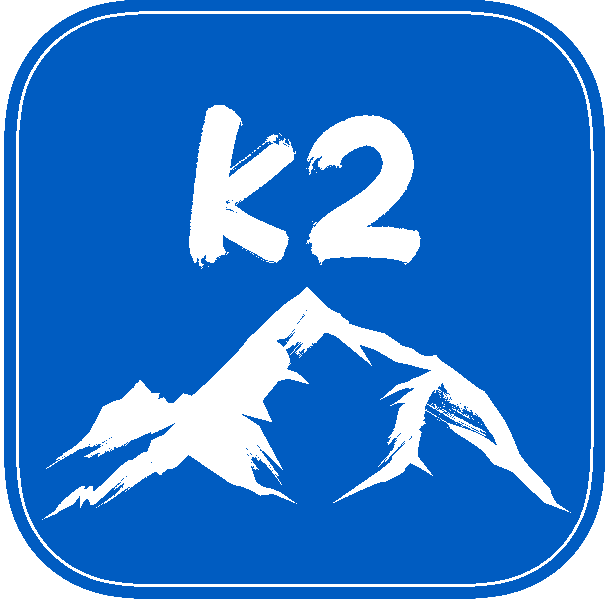

.. k2 documentation master file, created by
   sphinx-quickstart on Fri Oct  2 21:03:36 2020.
   You can adapt this file completely to your liking, but it should at least
   contain the root `toctree` directive.

-----------

k2
==

The vision of k2 is to be able to seamlessly integrate Finite State
Automaton (FSA) and Finite State Transducer (FST) algorithms into
autograd-based machine learning toolkits like PyTorch and TensorFlow.
For speech recognition applications, this should make it easy to
interpolate and combine various training objectives such as cross-entropy,
CTC and MMI and to jointly optimize a speech recognition system with multiple
decoding passes including lattice rescoring and confidence estimation.
We hope k2 will have many other applications as well.

One of the key algorithms that we want to make efficient in the short term
is pruned composition of a generic FSA with a "dense" FSA (i.e. one that
corresponds to log-probs of symbols at the output of a neural network).
This can be used as a fast implementation of decoding for ASR, and for CTC
and LF-MMI training. This won't give a direct advantage in terms of Word
Error Rate when compared with existing technology; but the point is to
do this in a much more general and extensible framework to allow further
development of ASR technology.

.. toctree::
   :maxdepth: 2
   :caption: Contents:

   installation
   core_concepts/index
   python_tutorials/index
   python_api/index
