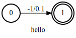

.. _install using conda:

Install using conda (Linux/macOS)
=================================

.. HINT::

  Windows is currently not supported via conda install.
  Please refer to :ref:`install k2 from source`
  or :ref:`install using pip via k2-fsa.org` if you
  want to install k2 on Windows.

All you need is the following line

.. code-block:: bash

  $ conda install -c k2-fsa -c pytorch -c nvidia k2 pytorch=1.13.0 pytorch-cuda=11.7 python=3.8

to install the **latest** k2 with Python 3.8, CUDA 11.7, and PyTorch 1.13.0.

.. hint::

  If you want to install PyTorch < 1.13, e.g., PyTorch 1.12.1, please use

  .. code-block:: bash

    $ conda install -c k2-fsa -c pytorch -c conda-forge k2 python=3.8 cudatoolkit=11.6 pytorch=1.12.1

  to install the **latest** k2 with Python 3.8, CUDA 11.6, and PyTorch 1.12.1.

.. hint::

   The above command is just an example. You can choose other versions of Python,
   cudatoolkit, and PyTorch as you want. For instance,

   .. code-block:: bash

      $ conda install -c k2-fsa -c pytorch -c conda-forge k2 python=3.9 cudatoolkit=11.6 pytorch=1.12.0

   The above command installs k2 with Python 3.9, cudatoolkit 11.6, and PyTorch 1.12.0

To Install a CPU version, use:

.. code-block:: bash

  conda install -c k2-fsa -c pytorch cpuonly k2 python=3.8 pytorch=1.13.0

We provide the following YouTube video showing how to install k2 via conda.

.. note::

   To get the latest news of `next-gen Kaldi <https://github.com/k2-fsa>`_, please subscribe
   the following YouTube channel by `Nadira Povey <https://www.youtube.com/channel/UC_VaumpkmINz1pNkFXAN9mw>`_:

      `<https://www.youtube.com/channel/UC_VaumpkmINz1pNkFXAN9mw>`_

..  youtube:: HerxbUHs-V4

.. HINT::

  If you encounter the following error::

    ModuleNotFoundError: no module named graphviz

  Please run::

    conda install -c anaconda graphviz

Read the following if you want to learn more.

Supported versions
------------------

.. |conda_python_versions| image:: ./images/python_ge_3.6-blue.svg
  :alt: Supported python versions

.. |conda_cuda_versions| image:: ./images/cuda_ge_10.1-orange.svg
  :alt: Supported cuda versions

.. |conda_pytorch_versions| image:: ./images/pytorch_ge_1.6.0-green.svg
  :alt: Supported pytorch versions

- |conda_python_versions|
- |conda_cuda_versions|
- |conda_pytorch_versions|

The conda package ``k2`` is available from the channel ``k2-fsa``, so
you have to use ``-c k2-fsa`` or ``--channel k2-fsa`` for ``conda install``.

It is recommended to specify the versions of Python, CUDA, and PyTorch while installing k2.
Supported versions are given in the above badges.

Search for available versions
-----------------------------

.. code-block:: bash

  conda search -c k2-fsa k2

lists the available versions. An example output is given below:

.. code-block::

  $ conda search -c k2-fsa k2
  Loading channels: done
  # Name                       Version           Build  Channel
  k2                   0.3.3.dev20210509_cuda10.1 cuda10.1_py3.6_torch1.6.0  k2-fsa
  k2                   0.3.3.dev20210509_cuda10.1 cuda10.1_py3.6_torch1.7.0  k2-fsa
  k2                   0.3.3.dev20210509_cuda10.1 cuda10.1_py3.6_torch1.7.1  k2-fsa
  (lots of lines are omitted)
  k2                   0.3.3.dev20210510_cuda11.0 cuda11.0_py3.6_torch1.7.1  k2-fsa
  k2                   0.3.3.dev20210510_cuda11.1 cuda11.1_py3.6_torch1.8.0  k2-fsa
  k2                   0.3.3.dev20210510_cuda11.1 cuda11.1_py3.6_torch1.8.1  k2-fsa
  (lots of lines are omitted)

Detailed installation instructions
----------------------------------

To install k2, let's first create a virtual environment:

.. code-block:: bash

  $ conda create -n foo python=3.7
  Collecting package metadata (current_repodata.json): done
  Solving environment: done

  ## Package Plan ##

    environment location: /xxx/anaconda3/2020.11/envs/foo

    added / updated specs:
      - python=3.7

  The following NEW packages will be INSTALLED:

    _libgcc_mutex      pkgs/main/linux-64::_libgcc_mutex-0.1-main
    ca-certificates    pkgs/main/linux-64::ca-certificates-2021.4.13-h06a4308_1
    certifi            pkgs/main/linux-64::certifi-2020.12.5-py37h06a4308_0
    ld_impl_linux-64   pkgs/main/linux-64::ld_impl_linux-64-2.33.1-h53a641e_7
    libffi             pkgs/main/linux-64::libffi-3.3-he6710b0_2
    libgcc-ng          pkgs/main/linux-64::libgcc-ng-9.1.0-hdf63c60_0
    libstdcxx-ng       pkgs/main/linux-64::libstdcxx-ng-9.1.0-hdf63c60_0
    ncurses            pkgs/main/linux-64::ncurses-6.2-he6710b0_1
    openssl            pkgs/main/linux-64::openssl-1.1.1k-h27cfd23_0
    pip                pkgs/main/linux-64::pip-21.0.1-py37h06a4308_0
    python             pkgs/main/linux-64::python-3.7.10-hdb3f193_0
    readline           pkgs/main/linux-64::readline-8.1-h27cfd23_0
    setuptools         pkgs/main/linux-64::setuptools-52.0.0-py37h06a4308_0
    sqlite             pkgs/main/linux-64::sqlite-3.35.4-hdfb4753_0
    tk                 pkgs/main/linux-64::tk-8.6.10-hbc83047_0
    wheel              pkgs/main/noarch::wheel-0.36.2-pyhd3eb1b0_0
    xz                 pkgs/main/linux-64::xz-5.2.5-h7b6447c_0
    zlib               pkgs/main/linux-64::zlib-1.2.11-h7b6447c_3

  Proceed ([y]/n)? y

  Preparing transaction: done
  Verifying transaction: done
  Executing transaction: done
  #
  # To activate this environment, use
  #
  #     $ conda activate foo
  #
  # To deactivate an active environment, use
  #
  #     $ conda deactivate

Second, activate the environment ``foo`` that we just created:

.. code-block::

  $ conda activate foo
  (foo) $

Third, determine the versions of Python, CUDA, and PyTorch you want to use.

Assuming you want to use Python 3.8, CUDA 11.1, and PyTorch 1.8.1. Then you can use
the following command to install k2:

.. code-block::

  (foo) $ conda install -c k2-fsa -c pytorch -c conda-forge k2 python=3.8 cudatoolkit=11.1 pytorch=1.8.1

.. caution::

  You have to specify ``-c k2-fsa -c pytorch -c conda-forge``. Otherwise, the installation will fail.

    - ``-c k2-fsa`` tells conda where to find ``k2``.
    - ``-c pytorch`` tells conda where to find ``pytorch=1.8.1``
    - ``-c conda-forge`` tells conda where to find ``cudatoolkit=11.1``

The output of the above command is:

.. code-block:: bash

  (foo) $ conda install -c k2-fsa -c pytorch -c conda-forge k2 python=3.8 cudatoolkit=11.1 pytorch=1.8.1
  Collecting package metadata (current_repodata.json): done
  Solving environment: done

  ## Package Plan ##

    environment location: /xxx/anaconda3/2020.11/envs/foo

    added / updated specs:
      - cudatoolkit=11.1
      - k2
      - python=3.8
      - pytorch=1.8.1

  The following packages will be downloaded:

      package                    |            build
      ---------------------------|-----------------
      cudatoolkit-11.1.1         |       h6406543_8        1.20 GB  conda-forge
      k2-0.3.3.dev20210509_cuda11.1|cuda11.1_py3.8_torch1.8.1        61.4 MB  k2-fsa
      pytorch-1.8.1              |py3.8_cuda11.1_cudnn8.0.5_0        1.27 GB  pytorch
      ------------------------------------------------------------
                                             Total:        2.54 GB

  The following NEW packages will be INSTALLED:

    _openmp_mutex      conda-forge/linux-64::_openmp_mutex-4.5-1_llvm
    blas               pkgs/main/linux-64::blas-1.0-mkl
    cudatoolkit        conda-forge/linux-64::cudatoolkit-11.1.1-h6406543_8
    k2                 k2-fsa/linux-64::k2-0.3.3.dev20210509_cuda11.1-cuda11.1_py3.8_torch1.8.1
    libuv              conda-forge/linux-64::libuv-1.41.0-h7f98852_0
    llvm-openmp        conda-forge/linux-64::llvm-openmp-11.1.0-h4bd325d_1
    mkl                conda-forge/linux-64::mkl-2020.4-h726a3e6_304
    mkl-service        conda-forge/linux-64::mkl-service-2.3.0-py38h1e0a361_2
    mkl_fft            conda-forge/linux-64::mkl_fft-1.3.0-py38h5c078b8_1
    mkl_random         conda-forge/linux-64::mkl_random-1.2.0-py38hc5bc63f_1
    ninja              conda-forge/linux-64::ninja-1.10.2-h4bd325d_0
    numpy              pkgs/main/linux-64::numpy-1.19.2-py38h54aff64_0
    numpy-base         pkgs/main/linux-64::numpy-base-1.19.2-py38hfa32c7d_0
    python_abi         conda-forge/linux-64::python_abi-3.8-1_cp38
    pytorch            pytorch/linux-64::pytorch-1.8.1-py3.8_cuda11.1_cudnn8.0.5_0
    six                conda-forge/noarch::six-1.16.0-pyh6c4a22f_0
    typing_extensions  conda-forge/noarch::typing_extensions-3.7.4.3-py_0

  The following packages will be UPDATED:

    certifi            pkgs/main::certifi-2020.12.5-py37h06a~ --> conda-forge::certifi-2020.12.5-py38h578d9bd_1
    libgcc-ng           pkgs/main::libgcc-ng-9.1.0-hdf63c60_0 --> conda-forge::libgcc-ng-9.3.0-h2828fa1_19
    libstdcxx-ng       pkgs/main::libstdcxx-ng-9.1.0-hdf63c6~ --> conda-forge::libstdcxx-ng-9.3.0-h6de172a_19
    pip                pkgs/main/linux-64::pip-21.0.1-py37h0~ --> conda-forge/noarch::pip-21.1.1-pyhd8ed1ab_0
    python                                  3.7.10-hdb3f193_0 --> 3.8.8-hdb3f193_5

  The following packages will be SUPERSEDED by a higher-priority channel:

    _libgcc_mutex           pkgs/main::_libgcc_mutex-0.1-main --> conda-forge::_libgcc_mutex-0.1-conda_forge
    ca-certificates    pkgs/main::ca-certificates-2021.4.13-~ --> conda-forge::ca-certificates-2020.12.5-ha878542_0
    openssl              pkgs/main::openssl-1.1.1k-h27cfd23_0 --> conda-forge::openssl-1.1.1k-h7f98852_0
    setuptools         pkgs/main::setuptools-52.0.0-py37h06a~ --> conda-forge::setuptools-49.6.0-py38h578d9bd_3

  Proceed ([y]/n)? y

  Downloading and Extracting Packages
  k2-0.3.3.dev20210509 | 61.4 MB   | ############################################################################################ | 100%
  pytorch-1.8.1        | 1.27 GB   | ############################################################################################ | 100%
  cudatoolkit-11.1.1   | 1.20 GB   | ############################################################################################ | 100%
  Preparing transaction: done
  Verifying transaction: done
  Executing transaction: - By downloading and using the CUDA Toolkit conda packages, you accept the terms and conditions of the CUDA End
  User License Agreement (EULA): https://docs.nvidia.com/cuda/eula/index.html

  done

To verify that k2 is installed successfully, use:

.. code-block:: bash

  (foo) $ python3 -m k2.version

It should print something like the following:

.. code-block:: bash

  (foo) $ python3 -m k2.version
  /xxx/anaconda3/2020.11/envs/foo/lib/python3.8/runpy.py:127: RuntimeWarning: 'k2.version' found in sys.modules after import of package 'k2', but prior to execution of 'k2.version'; this may result in unpredictable behaviour
    warn(RuntimeWarning(msg))
  Collecting environment information...

  k2 version: 0.3.3
  Build type: Release
  Git SHA1: 397b5b154d93b82eb58bc2eee11ca835b5aa138c
  Git date: Sun May 9 06:38:52 2021
  Cuda used to build k2: 11.1
  cuDNN used to build k2: 8.0.5
  Python version used to build k2: 3.8
  OS used to build k2: Ubuntu 16.04.7 LTS
  CMake version: 3.18.4
  GCC version: 5.5.0
  CMAKE_CUDA_FLAGS:  --expt-extended-lambda -gencode arch=compute_35,code=sm_35 --expt-extended-lambda -gencode arch=compute_50,code=sm_50 --expt-extended-lambda -gencode arch=compute_60,code=sm_60 --expt-extended-lambda -gencode arch=compute_61,code=sm_61 --expt-extended-lambda -gencode arch=compute_70,code=sm_70 --expt-extended-lambda -gencode arch=compute_75,code=sm_75 -D_GLIBCXX_USE_CXX11_ABI=0 --compiler-options -Wall --compiler-options -Wno-unknown-pragmas
  CMAKE_CXX_FLAGS:  -D_GLIBCXX_USE_CXX11_ABI=0
  PyTorch version used to build k2: 1.8.1
  PyTorch is using Cuda: 11.1
  NVTX enabled: True
  Disable debug: True
  Sync kernels : False
  Disable checks: False

The following code verifies that you can create an example FSA with k2:

.. code-block:: bash

  (foo) $ python3
  Python 3.8.8 (default, Apr 13 2021, 19:58:26)
  [GCC 7.3.0] :: Anaconda, Inc. on linux
  Type "help", "copyright", "credits" or "license" for more information.
  >>> import k2
  >>> s = '''
  ... 0 1 -1 0.1
  ... 1
  ... '''
  >>> fsa = k2.Fsa.from_str(s)
  >>> fsa.draw('hello.svg', title='hello')
  <graphviz.dot.Digraph object at 0x7ff88b1ca610>

Congratulations! You have installed k2 successfully.
