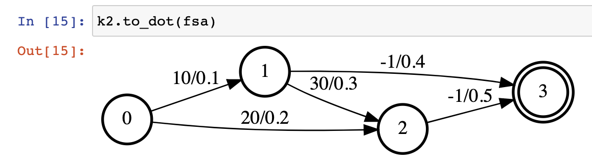
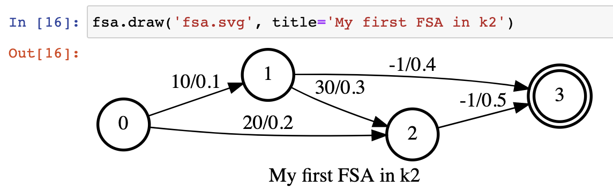
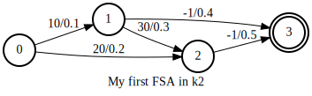
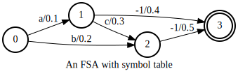

Fsa
===

In this tutorial, we will show:

  - How to create an FSA in k2
  - How to create a 1-D vector of FSAs in k2
  - Common methods of :class:`k2.Fsa`

Create a single FSA
-------------------

The following code shows how to create an FSA in k2:

.. code-block:: python

    s = '''
      0 1 10 0.1
      0 2 20 0.2
      1 2 30 0.3
      1 3 -1 0.4
      2 3 -1 0.5
      3
    '''
    fsa = k2.Fsa.from_str(s)

Please refer to :func:`k2.Fsa.from_str` for the format of the string `s` that must have.

The resulting FSA can be visualized via the following two APIs:

  - :func:`k2.to_dot`
  - :func:`k2.Fsa.draw`

.. HINT::

  graphviz needs to be installed in order to use the above two APIs.

The return value of :func:`k2.to_dot` can be visualized automagically in a jupyter notebook.
:numref:`to_dot_vis` is a screenshot of invoking :func:`k2.to_dot` for the above FSA.

.. _to_dot_vis:

    Screenshot of running :func:`k2.to_dot` in a jupyter notebook.

:func:`k2.Fsa.draw` is able to save the resulting FSA to a file for offline visualization.
Its return value can also be displayed in a jupyter notebook. A screenshot of running
:func:`k2.Fsa.draw` for the above FSA is shown in

.. _draw_vis:

    Screenshot of running :func:`k2.Fsa.draw` in a jupyter notebook.

The generated `fsa.svg` is visualized in :numref:`tutorial_fsa_svg`.

.. _tutorial_fsa_svg:

    fsa.svg generated by :func:`k2.Fsa.draw`.

You can also attach a symbol table to the above FSA:

.. code-block:: python

    sym_str = '''
      a 10
      b 20
      c 30
    '''
    symbols = k2.SymbolTable.from_str(sym_str)
    fsa.symbols = symbols
    fsa.draw('fsa_symbols.svg', title='An FSA with symbol table')

The visualization result is given in :numref:`tutorial_fsa_symbols`.

.. _tutorial_fsa_symbols:

    Visualization of an FSA with a symbol table.

To attach a symbol table to an FSA, just assign an instance of class :class:`k2.SymbolTable`
to the `symbols` attribute of the FSA.

Create a FsaVec
---------------

You can use :func:`k2.create_fsa_vec` to create a FsaVec from a list of FSAs.
For example,

.. code-block::

  fsa_vec = k2.create_fsa_vec([fsa, fsa])

Both `FsaVec` and `FSA` are represented by a single Python class :class:`k2.Fsa`.
You can tell whether an instance of :class:`k2.Fsa` is a single FSA or a FsaVec
from its property :py:attr:`k2.Fsa.shape`:

  - For a single FSA, :py:attr:`k2.Fsa.shape` returns a tuple with two elements `(num_states, None)`
  - For a FsaVec, :py:attr:`k2.Fsa.shape` returns a tuple with three elements `(num_fsas, None, None)`
