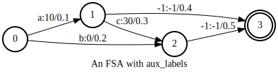
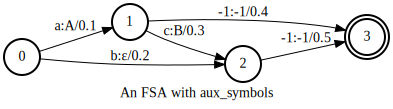
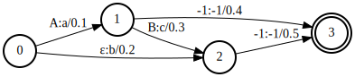

Fsa
===

In this tutorial, we will show:

  - How to create an FSA in k2
  - How to create a 1-D vector of FSAs in k2
  - Common methods of :class:`k2.Fsa`

A single FSA
------------

The following code shows how to create an FSA in k2:

.. code-block:: python

    s = '''
      0 1 10 0.1
      0 2 20 0.2
      1 2 30 0.3
      1 3 -1 0.4
      2 3 -1 0.5
      3
    '''
    fsa = k2.Fsa.from_str(s)

Please refer to :func:`k2.Fsa.from_str` for the format of the string `s` that must have.

Visualization
~~~~~~~~~~~~~

The resulting FSA can be visualized via the following two APIs:

  - :func:`k2.to_dot`
  - :func:`k2.Fsa.draw`

.. HINT::

  You have to install graphviz in order to use the above two APIs. It can be installed
  using the following command::

    pip install graphviz

The return value of :func:`k2.to_dot` can be visualized automagically in a jupyter notebook.
:numref:`to_dot_vis` is a screenshot of invoking :func:`k2.to_dot` for the above FSA.

.. _to_dot_vis:
.. figure:: images/to_dot.png
    :alt: Result of to_dot
    :align: center
    :figwidth: 600px

    Screenshot of running :func:`k2.to_dot` in a jupyter notebook.

:func:`k2.Fsa.draw` is able to save the resulting FSA to a file for offline visualization.
Its return value can also be displayed in a jupyter notebook. A screenshot of running
:func:`k2.Fsa.draw` for the above FSA is shown in

.. _draw_vis:
.. figure:: images/draw.png
    :alt: Result of Fsa.draw
    :align: center
    :figwidth: 600px

    Screenshot of running :func:`k2.Fsa.draw` in a jupyter notebook.

The generated `fsa.svg` is visualized in :numref:`tutorial_fsa_svg`.

.. _tutorial_fsa_svg:
.. figure:: images/fsa.svg
    :alt: fsa.svg
    :align: center
    :figwidth: 600px

    fsa.svg generated by :func:`k2.Fsa.draw`.

Symbol table
~~~~~~~~~~~~
You can also attach a symbol table to the above FSA:

.. code-block:: python

    sym_str = '''
      a 10
      b 20
      c 30
    '''
    fsa.labels_sym = k2.SymbolTable.from_str(sym_str)
    fsa.draw('fsa_symbols.svg', title='An FSA with symbol table')

The visualization result is given in :numref:`tutorial_fsa_symbols`.

.. _tutorial_fsa_symbols:
.. figure:: images/fsa_symbols.svg
    :alt: fsa_symbols.svg
    :align: center
    :figwidth: 600px

    Visualization of an FSA with a symbol table.

To attach a symbol table to an FSA, just assign an instance of class :class:`k2.SymbolTable`
to the ``labels_sym`` attribute of the FSA.

Auxiliary labels
~~~~~~~~~~~~~~~~

You can also attach an integer attribute to every arc in the FSA. If the attribute
name is ``aux_labels``, the resulting FSA is viewed as an FST in k2.

An example is given below.

.. code-block:: python

   fsa.aux_labels = torch.tensor([10, 0, 30, -1, -1]).to(torch.int32)
   fsa.draw('fsa_aux.svg', title='An FSA with aux_labels')

.. HINT::

  We require that `aux_labels` is either a `torch.Tensor` with dtype `torch.int32`
  or a ragged tensor of type :class:`k2.RaggedInt`.
  Also note that the `aux_labels` for arcs entering the final state are -1.

Auxiliary symbol table
~~~~~~~~~~~~~~~~~~~~~~

If an FSA is assigned an attribute with name ``aux_labels_sym``,
its ``aux_labels`` is visualized with human readable strings instead of integer
IDs (the same

The following is an example.

.. code-block:: python

  aux_labels_sym = k2.SymbolTable.from_str('''
    A 10
    B 30
  ''')
  fsa.aux_labels_sym = aux_labels_sym
  fsa.draw('fsa_aux_symbols.svg', title='An FSA with aux_symbols')

invert
~~~~~~

``labels`` and ``aux_labels`` can be swapped using :func:`k2.Fsa.invert`
or :func:`k2.Fsa.invert_`::

  fsa.invert_()
  fsa.draw('fsa_invert.svg')

`fsa_invert.svg` is shown in :numref:`tutorial_fsa_invert`.

.. _tutorial_fsa_invert:

    Invert an FSA.

.. CAUTION::

  It is a convention in k2 that a method with name ending with an underscore
  changes the object in-place. :func:`k2.Fsa.invert` returns a new FSA,
  whereas :func:`k2.Fsa.invert_` modifies `self` in-place.

scores
~~~~~~

``scores`` is one of the most important attributes of an FSA. There
is a score for every arc and ``k2.Fsa.scores`` returns the scores
of an FSA in a 1-D `torch.Tensor` with dtype `torch.float32`::

  print(fsa.scores)
  # it prints:
  #   tensor([0.1000, 0.2000, 0.3000, 0.4000, 0.5000])

is_cpu
~~~~~~

k2 supports CPU as well as CUDA. You can tell whether an FSA is on CPU with
:func:`k2.Fsa.is_cpu`::

  print(fsa.is_cpu())

If `fsa` is on CPU, the above code prints `True`; otherwise, it prints `False`.

is_cuda
~~~~~~~

To test whether an FSA is on CUDA GPU or not, you can use::

  print(fsa.is_cuda())

If it prints `True`, the `fsa` is on a CUDA GPU; otherwise, it is on CPU.

to
~~

An FSA can be moved among different devices with :func:`k2.Fsa.to`::

  device = torch.device('cpu')
  fsa = fsa.to(device)
  assert fsa.is_cpu()

  assert fsa.device == torch.device('cpu')

  fsa = fsa.to('cuda:1')
  assert fsa.is_cuda()

  assert fsa.device == torch.device('cuda', 1)

Note that you can use :py:attr:`k2.Fsa.device` to get the device on which
the current FSA resides.

A list of FSAs: FsaVec
----------------------

You can use :func:`k2.create_fsa_vec` to create a FsaVec from a list of FSAs.
For example,

.. code-block::

  fsa_vec = k2.create_fsa_vec([fsa, fsa])

Both `FsaVec` and `FSA` are represented by a single Python class :class:`k2.Fsa`.
You can tell whether an instance of :class:`k2.Fsa` is a single FSA or a FsaVec
from its property :py:attr:`k2.Fsa.shape`:

  - For a single FSA, :py:attr:`k2.Fsa.shape` returns a tuple with two elements `(num_states, None)`
  - For a FsaVec, :py:attr:`k2.Fsa.shape` returns a tuple with three elements `(num_fsas, None, None)`
