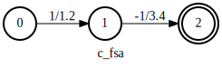

Fsa algorithms
==============

This tutorial describes algorithms supported by k2.
Most of the algorithms support both CPU and CUDA.
A few of them support only CPU, which is documented
explicitly in the corresponding documentation.

.. NOTE::

  All algorithms support FsaVec. A few of them also
  support single FSAs.

invert
~~~~~~

:func:`k2.invert` swaps the ``labels`` and ``aux_labels`` of a :class:`k2.Fsa`.

The following is an example swapping the ``labels`` and ``aux_labels`` of an FSA.

.. literalinclude:: ./code/invert1.py
  :caption: Example code for :func:`k2.invert`
  :language: python
  :lines: 2-

Its outputs are given below:

.. figure:: images/before_invert.svg
    :alt: before_invert
    :align: center
    :figwidth: 600px

When ``aux_labels`` is a ragged tensor, new arcs will be added after the invert.

The following code applies :func:`k2.invert` to an FSA
with ragged tensors as ``aux_labels``.

.. literalinclude:: ./code/invert2.py
  :caption: :func:`k2.invert` for FSAs with ragged tensors as ``aux_labels``
  :language: python
  :lines: 2-

.. figure:: images/before_invert_aux.svg
    :alt: before_invert_aux
    :align: center
    :figwidth: 600px

.. figure:: images/after_invert_aux.svg
    :alt: after_invert_aux
    :align: center
    :figwidth: 600px

    Example of :func:`k2.invert` for FSAs with ragged tensors as ``aux_labels``.

.. NOTE::

  - :func:`k2.invert` supports CUDA as well as CPU.
  - autograd is also supported.
  - Its input can be either a single FSA or a FsaVec.

arc_sort
~~~~~~~~

:func:`k2.intersect` and :func:`k2.compose` require two
arc-sorted inputs. You can use :func:`k2.arc_sort` to convert
an unsorted FSA/FsaVec into a sorted FSA/FsaVec.

An FSA is sorted if for each state, its leaving arcs are sorted
by ``labels`` in ascending order.

.. CAUTION::

  Arcs entering the final state have label -1. During sorting,
  -1 is reinterpreted as an unsigned number. Internally, all
  labels are reinterpreted as unsigned numbers during sorting.

An example of :func:`k2.arc_sort` is given below.

.. literalinclude:: ./code/arc_sort.py
  :caption: :func:`k2.arc_sort` example
  :language: python
  :lines: 2-

.. figure:: images/after_sort.svg
    :alt: after_sort
    :align: center
    :figwidth: 600px

.. NOTE::

  - :func:`k2.arc_sort` supports CUDA as well as CPU.
  - autograd is also supported.
  - Its input can be either a single FSA or a FsaVec.

.. HINT::

  Inside :func:`k2.arc_sort` it checks whether the input
  FSA is sorted or not. If the input is already sorted, it
  is returned directly. Otherwise, a new sorted FSA is returned.

intersect
~~~~~~~~~

The following is an example of :func:`k2.intersect`.

.. literalinclude:: ./code/intersect1.py
  :caption: Example code for :func:`k2.intersect`
  :language: python
  :lines: 2-

The outputs are shown below

.. figure:: images/a_fsa_intersect.svg
    :alt: a_fsa
    :align: center
    :figwidth: 600px

.. figure:: images/b_fsa_intersect.svg
    :alt: b_fsa
    :align: center
    :figwidth: 600px

:func:`k2.intersect` has an optional argument ``treat_epsilons_specially``.
Its default value is `True`. If it is set to `False`, then the label `0`
is treated as a normal label. The following is an example setting
``treat_epsilons_specially`` to `False`.

.. literalinclude:: ./code/intersect2.py
  :caption: Example code for :func:`k2.intersect` with ``treat_epsilons_specially=False``
  :language: python
  :lines: 2-

The outputs are shown below

.. figure:: images/a_fsa_intersect2.svg
    :alt: a_fsa
    :align: center
    :figwidth: 600px

.. figure:: images/b_fsa_intersect2.svg
    :alt: b_fsa
    :align: center
    :figwidth: 600px

    Note that ``c_fsa`` contains a single path
    when ``treat_epsilons_specially`` is `False`.

.. NOTE::

  - :func:`k2.intersect` supports **ONLY** CPU
  - autograd is also supported.
  - Its input can be either a single FSA or a FsaVec.
  - The input FSAs have to be arc sorted.

connect
~~~~~~~

:func:`k2.connect` removes states that are neither
accessible nor co-accessible.
It is often used after :func:`k2.intersect` or :func:`k2.compose`.

The following is an example.

.. literalinclude:: ./code/connect.py
  :caption: :func:`k2.connect` example
  :language: python
  :lines: 2-

.. figure:: images/b_fsa_1.svg
    :alt: b_fsa_1
    :align: center
    :figwidth: 600px

.. NOTE::

  - :func:`k2.connect` supports **ONLY** CPU
  - autograd is also supported.
  - Its input can be either a single FSA or a FsaVec.
