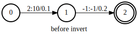
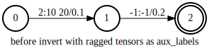
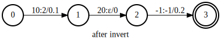
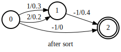
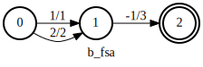
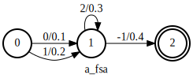
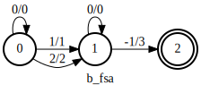
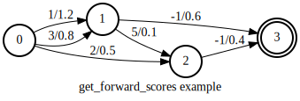

Fsa algorithms
==============

This tutorial describes algorithms supported by k2.
Most of the algorithms support both CPU and CUDA.
A few of them support only CPU, which is documented
explicitly in the corresponding documentation.

.. NOTE::

  All algorithms support FsaVec. A few of them also
  support single FSAs.

invert
~~~~~~

:func:`k2.invert` swaps the ``labels`` and ``aux_labels`` of a :class:`k2.Fsa`.

The following is an example swapping the ``labels`` and ``aux_labels`` of an FSA.

.. literalinclude:: ./code/invert1.py
  :caption: Example code for :func:`k2.invert`
  :language: python
  :lines: 2-

Its outputs are given below:

.. figure:: images/after_invert.svg
    :alt: after_invert
    :align: center
    :figwidth: 600px

When ``aux_labels`` is a ragged tensor, new arcs will be added after the invert.

The following code applies :func:`k2.invert` to an FSA
with ragged tensors as ``aux_labels``.

.. literalinclude:: ./code/invert2.py
  :caption: :func:`k2.invert` for FSAs with ragged tensors as ``aux_labels``
  :language: python
  :lines: 2-

    Example of :func:`k2.invert` for FSAs with ragged tensors as ``aux_labels``.

.. NOTE::

  - :func:`k2.invert` supports CUDA as well as CPU.
  - autograd is also supported.
  - Its input can be either a single FSA or a FsaVec.

arc_sort
~~~~~~~~

:func:`k2.intersect` and :func:`k2.compose` require two
arc-sorted inputs. You can use :func:`k2.arc_sort` to convert
an unsorted FSA/FsaVec into a sorted FSA/FsaVec.

An FSA is sorted if for each state, its leaving arcs are sorted
by ``labels`` in ascending order. If there is a tie, destination
states are used for sorting.

.. CAUTION::

  Arcs entering the final state have label -1. During sorting,
  -1 is reinterpreted as an unsigned number. Internally, all
  labels are reinterpreted as unsigned numbers during sorting.

An example of :func:`k2.arc_sort` is given below.

.. literalinclude:: ./code/arc_sort.py
  :caption: :func:`k2.arc_sort` example
  :language: python
  :lines: 2-

.. figure:: images/before_sort.svg
    :alt: before_sort
    :align: center
    :figwidth: 600px

.. NOTE::

  - :func:`k2.arc_sort` supports CUDA as well as CPU.
  - autograd is also supported.
  - Its input can be either a single FSA or a FsaVec.

.. HINT::

  Inside :func:`k2.arc_sort` it checks whether the input
  FSA is sorted or not. If the input is already sorted, it
  is returned directly. Otherwise, a new sorted FSA is returned.

intersect
~~~~~~~~~

The following is an example of :func:`k2.intersect`.

.. literalinclude:: ./code/intersect1.py
  :caption: Example code for :func:`k2.intersect`
  :language: python
  :lines: 2-

The outputs are shown below

.. figure:: images/a_fsa_intersect.svg
    :alt: a_fsa
    :align: center
    :figwidth: 600px

.. figure:: images/c_fsa_intersect.svg
    :alt: c_fsa
    :align: center
    :figwidth: 600px

:func:`k2.intersect` has an optional argument ``treat_epsilons_specially``.
Its default value is `True`. If it is set to `False`, then the label `0`
is treated as a normal label. The following is an example setting
``treat_epsilons_specially`` to `False`.

.. literalinclude:: ./code/intersect2.py
  :caption: Example code for :func:`k2.intersect` with ``treat_epsilons_specially=False``
  :language: python
  :lines: 2-

The outputs are shown below

.. figure:: images/b_fsa_intersect2.svg
    :alt: b_fsa
    :align: center
    :figwidth: 600px

.. figure:: images/c_fsa_intersect2.svg
    :alt: c_fsa
    :align: center
    :figwidth: 600px

    Note that ``c_fsa`` contains a single path
    when ``treat_epsilons_specially`` is `False`.

:func:`k2.add_epsilon_self_loops` can be used to add epsilon self loops
to an FSA when ``treat_epsilons_specially`` is `False` but you
want to treat them specially. The following is an example
using :func:`k2.add_epsilon_self_loops` with
``treat_epsilons_specially == False``.

.. literalinclude:: ./code/intersect3.py
  :caption: :func:`k2.intersect` with ``treat_epsilons_specially=False`` and :func:`k2.add_epsilon_self_loops`
  :language: python
  :lines: 2-

.. figure:: images/a_fsa_intersect3.svg
    :alt: a_fsa
    :align: center
    :figwidth: 600px

.. figure:: images/c_fsa_intersect3.svg
    :alt: c_fsa
    :align: center
    :figwidth: 600px

    Note that ``c_fsa`` contains two paths
    even if ``treat_epsilons_specially`` is `False`
    since we have added epsilon self loops to `b_fsa`.

.. NOTE::

  - :func:`k2.intersect` supports **ONLY** CPU
  - autograd is also supported.
  - Its input can be either a single FSA or a FsaVec.
  - The input FSAs have to be arc sorted.

connect
~~~~~~~

:func:`k2.connect` removes states that are neither
accessible nor co-accessible.
It is often used after :func:`k2.intersect` or :func:`k2.compose`.

The following is an example.

.. literalinclude:: ./code/connect.py
  :caption: :func:`k2.connect` example
  :language: python
  :lines: 2-

.. figure:: images/a_fsa_1.svg
    :alt: a_fsa_1
    :align: center
    :figwidth: 600px

.. figure:: images/b_fsa_1.svg
    :alt: b_fsa_1
    :align: center
    :figwidth: 600px

.. figure:: images/before_connect.svg
    :alt: before_connect
    :align: center
    :figwidth: 600px

.. figure:: images/after_connect.svg
    :alt: after_connect
    :align: center
    :figwidth: 600px

.. NOTE::

  - :func:`k2.connect` supports **ONLY** CPU
  - autograd is also supported.
  - Its input can be either a single FSA or a FsaVec.

.. _get_forward_scores_example:

get_forward_scores
~~~~~~~~~~~~~~~~~~

:func:`k2.Fsa.get_forward_scores` computes and returns forward scores per state
(like alphas in `Baum-Welch <https://en.wikipedia.org/wiki/Baum%E2%80%93Welch_algorithm#Forward_procedure>`_)
or forward best-path scores if ``log_semiring`` is `False`.

.. Caution::

  Arc scores are in log scale.

We will use the following code as an example to demonstrate how :func:`k2.Fsa.get_forward_scores`
works in k2.

.. literalinclude:: ./code/get_forward_scores.py
  :caption: :func:`k2.Fsa.get_forward_scores` example
  :language: python
  :lines: 2-

The outputs are::

  get_forward_scores for log semiring: tensor([0.0000, 1.7130, 2.0513, 3.0777], dtype=torch.float64)
  get_forward_scores for tropical semiring: tensor([0.0000, 1.2000, 1.3000, 1.8000], dtype=torch.float64)

:func:`k2.Fsa.get_forward_scores` has two arguments:

  - ``use_double_scores``

    When it is `True`, double precision floats are used in the computation  and
    the returned tensor has dtype `torch.float64`; when it is `False`, the computation
    uses single precision floats and returned tensor's dtype is `torch.float32`.

  - ``log_semiring``

    When it is `True`, this function combines path scores with `LogAdd`, e.g., :math:`\log(e^a + e^b)`.
    When it is `False`, path scores are combined with :math:`\max(a, b)`

The following two subsections illustrate step by step how to obtain the above printed results.
For ease of reference, we use :math:`f_i` to denote the forward score of state :math:`i`.

log_semiring==True
^^^^^^^^^^^^^^^^^^^

It uses `LogAdd` to combine path scores.

1. State 0 is the start state and :math:`f_0` is defined to be 0.
2. :math:`f_1` is computed with the following formula:

  .. math::

    f_1 = \log(e^{f_0 + 1.2} + e^{f_0 + 0.8}) = \log(e^{1.2} + e^{0.8}) = 1.7130

  where 1.2 is the score of one of the two arcs from state 0 to state 1; 0.8 is the score of
  the other arc from state 0 to state 1.

3. :math:`f_2` is computed by:

   .. math::

    f_2 = \log(e^{f_0 + 0.5} + e^{f_1 + 0.1}) = \log(e^{0.5} + e^{1.8130}) = 2.0513

4. :math:`f_3` can be computed from :math:`f_1` and :math:`f_2`:

   .. math::

    f_3 = \log(e^{f_1 + 0.6} + e^{f_2 + 0.4}) = \log(e^{2.3130} + e^{2.4513}) = 3.0777

log_semiring==False
^^^^^^^^^^^^^^^^^^^

It uses `max` to combine path scores.

1. State 0 is the start state and :math:`f_0` is defined to be 0
2. :math:`f_1 = \max(f_0 + 1.2, f_0 + 0.8) = \max(1.2, 0.8) = 1.2`
3. :math:`f_2 = \max(f_0 + 0.5, f_1 + 0.1) = \max(0.5, 1.3) = 1.3`
4. :math:`f_3 = \max(f_1 + 0.6, f_2 + 0.4) = \max(1.8, 1.7) = 1.8`

.. NOTE::

  - :func:`k2.Fsa.get_forward_scores` supports CUDA as well as CPU.
  - autograd is also supported.
  - It supports only FsaVec.

get_tot_scores
~~~~~~~~~~~~~~

:func:`k2.Fsa.get_tot_scores` computes and returns forward scores of the final state of each FSA.
Refer to :ref:`get_forward_scores_example` for how to compute forward scores.

The following is an example of :func:`k2.Fsa.get_tot_scores`.

.. literalinclude:: ./code/get_tot_scores.py
  :caption: :func:`k2.Fsa.get_tot_scores` example
  :language: python
  :lines: 2-

.. figure:: images/get_tot_scores.svg
    :alt: get_tot_scores
    :align: center
    :figwidth: 600px

It prints::

  get_tot_scores for log semiring: tensor([3.0777], dtype=torch.float64)
  get_tot_scores for tropical semiring: tensor([1.8000], dtype=torch.float64)

.. NOTE::

  - :func:`k2.Fsa.get_tot_scores` supports CUDA as well as CPU.
  - autograd is also supported.
  - It supports only FsaVec.
