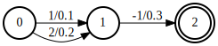

Basics
======

In this tutorial, we describe

  - What are ragged tensors?

     - What are the differences between ragged tensors and regular tensors?
     - How to create ragged tensors?

  - Various concepts relevant to ragged tensors, including

     - What is ``RaggedShape``?
     - What is ``row_splits`` ?
     - What is ``row_ids`` ?

What are ragged tensors?
------------------------

Before talking about what ragged tensors are, let's look at what non-ragged
tensors, i.e., regular tensors, look like.

  - 2-D regular tensors

    .. literalinclude:: code/basics/regular-tensors.py
       :language: python
       :lines: 8-20

    The shape of the 2-D regular tensor ``a`` is ``(3, 4)``, meaning it has 3
    rows and 4 columns. Each row has **exactly** 4 elements.

  - 3-D regular tensors

    .. literalinclude:: code/basics/regular-tensors.py
       :language: python
       :lines: 24-45

    The shape of the 3-D regular tensor ``b`` is ``(3, 3, 2)``, meaning it has
    3 planes. Each plane has **exactly** 3 rows and each row has **exactly** two
    entries

  - N-D regular tensors (N >= 4)

    We assume you know how to create N-D regular tensors.

After looking at what non-ragged tensors look like, let's have a look at ragged
tensors in ``k2``.

  - 2-D ragged tensors

    .. literalinclude:: code/basics/ragged-tensors.py
       :language: python
       :lines: 7-16

    The 2-D ragged tensor ``c`` has 4 rows. However, unlike regular tensors,
    each row in ``c`` can have different number of elements. In this case,

      - Row 0 has 5 entries: ``[1, 2, 3, 6, -5]``
      - Row 1 has 2 entries: ``[0, 1]``
      - Row 2 is empty. It has no entries.
      - Row 3 has only 1 entry: ``[3]``

    .. Hint::

      In ``k2``, we say that ``c`` is a ragged tensor with **two axes**.

  - 3-D ragged tensors

    .. literalinclude:: code/basics/ragged-tensors.py
       :language: python
       :lines: 20-40

    The 3-D ragged tensor ``d`` has 4 planes. Different from regular tensors,
    different planes in a ragged tensor can have different number of rows.
    Moreover, different rows within a plane can also have different number
    of entries.

    .. Hint::

      In ``k2``, we say that ``d`` is a ragged tensor with **three axes**.

  - N-D ragged tensors (N >= 4)

    Having seen how to create 2-D and 3-D ragged tensors, we assume you know how to
    create N-D ragged tensors.

A ragged tensor in ``k2`` has ``N`` (``N >= 2``) axes. Unlike regular tensors,
each axis of a ragged tensor can have different number of elements.

Ragged tensors are **the most important** data structure in ``k2``. FSAs are
represented as ragged tensors. There are also various operations defined on ragged
tensors.

At this point, we assume you know how to create ``N-D`` ragged tensors in ``k2``.
Let us do some exercises to check what you have learned.

Exercise 1
^^^^^^^^^^

.. container:: toggle

    .. container:: header

        .. Note::

          How to create a ragged tensor with 2 axes, satisfying the following
          constraints:

            - It has 3 rows.
            - Row 0 has elements: ``1, 10, -1``
            - Row 1 is empty, i.e., it has no elements.
            - Row 2 has two elements: ``-1.5, 2``

          (Click ▶ to view the solution)

    .. literalinclude:: code/basics/ragged-tensors.py
       :language: python
       :lines: 43-49

Exercise 2
^^^^^^^^^^

.. container:: toggle

    .. container:: header

        .. Note::

          How to create a ragged tensor with only 1 axis?

          (Click ▶ to view the solution)

    You **cannot** create a ragged tensor with only 1 axis. Ragged tensors
    in ``k2`` have at least 2 axes.

dtype and device
^^^^^^^^^^^^^^^^

Like tensors in PyTorch. ragged tensors in ``k2`` has attributes ``dtype`` and
``device``. The following code shows that you can specify the ``dtype`` and
``device`` while constructing ragged tensors.

.. literalinclude:: code/basics/dtype-device.py
   :language: python
   :lines: 3-23

.. container:: toggle

    .. container:: header

        .. Note::

          (Click ▶ to view the output)

    .. literalinclude:: code/basics/dtype-device.py
       :language: python
       :lines: 25-50

Concepts about ragged tensors
-----------------------------

A ragged tensor in ``k2`` consists of two parts:

  - ``shape``, which is an instance of :class:`k2.RaggedShape`

    .. Caution::

      It is assumed that a shape within a ragged tensor in ``k2`` is a constant.
      Once constructed, you are not expected to modify it. Otherwise, unexpected
      things can happen; you will be SAD.

  - ``values``, which is an **array** of type ``T``

    .. Hint::

      ``values`` is stored ``contiguously`` in memory, whose entries have to be
      of the same type ``T``. ``T`` can be either primitive types, such as
      ``int``, ``float``, and ``double`` or can be user defined types. For instance,
      ``values`` in FSAs contains ``arcs``, which is defined in C++
      `as follows <https://github.com/k2-fsa/k2/blob/master/k2/csrc/fsa.h#L31>`_:

      .. code-block:: c++

          struct Arc {
            int32_t src_state;
            int32_t dest_state;
            int32_t label;
            float score;
          }

Before explaining what ``shape`` and ``values`` contain, let us look at an example of
how to use a ragged tensor to represent the following
FSA (see :numref:`ragged_basics_simple_fsa_1`).

.. _ragged_basics_simple_fsa_1:

    An simple FSA that is to be represented by a ragged tensor.

The FSA in :numref:`ragged_basics_simple_fsa_1` has 3 arcs and 3 states.

+---------+--------------------+--------------------+--------------------+--------------------+
|         |      src_state     |     dst_state      |         label      |       score        |
+---------+--------------------+--------------------+--------------------+--------------------+
| Arc 0   |       0            |        1           |          1         |         0.1        |
+---------+--------------------+--------------------+--------------------+--------------------+
| Arc 1   |       0            |        1           |          2         |         0.2        |
+---------+--------------------+--------------------+--------------------+--------------------+
| Arc 2   |       1            |        2           |          -1        |         0.3        |
+---------+--------------------+--------------------+--------------------+--------------------+

When the above FSA is saved in a ragged tensor, its arcs are saved in a 1-D contiguous
``values`` array containing ``[Arc0, Arc1, Arc2]``.
At this point, you might ask:

  - As we can construct the original FSA by using the ``values`` array,
    what's the point of saving it in a ragged tensor?

Using the ``values`` array alone is not possible to answer the following questions in ``O(1)``
time:

  - How many states does the FSA have ?
  - How many arcs does each state have ?
  - Where do the arcs belonging to state 0 start in the ``values`` array ?

To handle the above questions, we introduce another 1-D array, called ``row_splits``.
``row_splits[s] = p`` means for state ``s`` its first outgoing arc starts at position
``p`` in the ``values`` array. As a side effect, it also indicates that the last outgoing
arc for state ``s-1`` ends at position ``p`` (exclusive) in the ``values`` array.

In our example, ``row_splits`` would be ``[0, 2, 3, 3]``, meaning:

  - The first outgoing arc for state 0 is at position ``row_splits[0] = 0``
    in the ``values`` array
  - State 0 has ``row_splits[1] - row_splits[0] = 2 - 0 = 2`` arcs
  - The first outgoing arc for state 1 is at position ``row_splits[1] = 2``
    in the ``values`` array
  - State 1 has ``row_splits[2] - row_splits[1] = 3 - 2 = 1`` arc
  - State 2 has no arcs since ``row_splits[3] - row_splits[2] = 3 - 3 = 0``
  - The FSA has ``len(row_splits) - 1 = 3`` states.

We can construct a ``RaggedShape`` from a ``row_splits`` array:

.. literalinclude:: code/basics/ragged_shape_1.py
   :language: python
   :lines: 3-14

Pay attention to the string form of the shape ``[ [x x] [x] [ ] ]``.
``x`` means we don't care about the actual content inside a ragged tensor.
The above shape has 2 axes, 3 rows, and 3 elements. Row 0 has two elements as there
are two ``x`` inside the 0th ``[]``. Row 1 has only one element, while
row 2 has no elements at all. We can assign names to the axes. In our case,
we say the shape has axes ``[state][arc]``.

Combining the ragged shape and the ``values`` array, the above FSA can
be represented using a ragged tensor ``[ [Arc0 Arc1] [Arc2] [ ] ]``.

The following code displays the string from of the above FSA when represented
as a ragged tensor in k2:

.. literalinclude:: code/basics/single-fsa.py
   :language: python
   :lines: 2-14

Shape
^^^^^

To be done.

data
^^^^

TBD.
